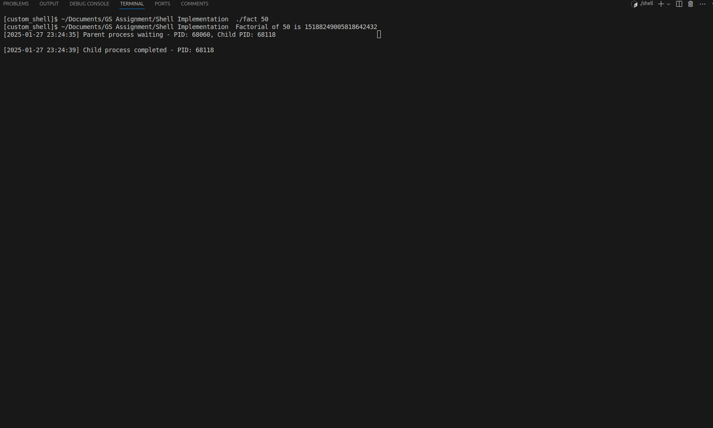

# Custom Command-Line Shell in C

## Overview

This project implements a custom command-line shell in C, offering an interactive user interface to execute various commands. It supports built-in commands, custom programs, I/O redirection, command history, and efficient system resource usage while adhering to best coding practices.

---

## Features and Implementation Details

### **1. Command Execution**
#### **Accept User Input**
- The shell uses the `ncurses` library for an interactive terminal experience. User input is read dynamically and stored in a custom string buffer.
- The current working directory is displayed in the prompt using `get_formatted_cwd()`.

#### **Parse the Input into Arguments**
- Input strings are tokenized using the `parse_command()` function, which handles quoted and unquoted arguments, supporting flexible command formatting.

#### **Execute Commands**
- External commands are executed using `fork()` and `execvp()`. The parent process waits for the child process to finish using `waitpid()`.
- The `execute_command()` function supports the following:
  - Built-in commands like `cd`, `exit`, and `help`.
  - External commands with I/O redirection (`<` and `>`).

#### **Error Handling**
- All system calls (e.g., `fork()`, `execvp()`, `chdir()`) include error-checking mechanisms. Descriptive error messages are printed to the terminal for failures.

---

### **2. Advanced Features**

#### **Command History**
- Previous commands are stored in a history buffer, and users can navigate through them using `UP` and `DOWN` keys.
- Reverse search is supported using `CTRL+R` to find commands matching a search term.

#### **Keyboard Shortcuts**
- `CTRL+A`: Move to the beginning of the line.
- `CTRL+E`: Move to the end of the line.
- `CTRL+K`: Cut text after the cursor.
- `CTRL+U`: Cut text before the cursor.
- `CTRL+Y`: Paste cut text.
- `CTRL+L`: Clear the screen while keeping the prompt.
- `CTRL+R`: Reverse search through command history.

#### **I/O Redirection**
- Input redirection (`< input.txt`) and output redirection (`> output.txt`) are handled using `dup2()`.
- Redirection tokens are removed from the arguments to ensure proper command execution.

---

### **3. Process Tree Visualization**
- The shell spawns child processes for command execution. By capturing the system's process hierarchy, users can visualize the parent-child relationship.
- A snapshot of the process tree and PID visualization is included below:




---

### **4. Modular Code Structure**

#### **Key Functions**
- `parse_command()`: Tokenizes user input.
- `execute_command()`: Manages external command execution and I/O redirection.
- `handle_cd()`: Implements the `cd` command.
- `execute_help_command()`: Displays a help menu.
- `handle_io_redirection()`: Handles input and output redirection.
- `init_shell_state()`: Initializes the shell's state for command handling.
- `handle_history()`: Manages command history navigation.

#### **Utility Functions**
- String handling utilities like `string_init()`, `string_append()`, and `string_clear()` ensure dynamic and efficient memory management.
- `get_formatted_cwd()`: Formats the current working directory for display.

#### **Header Guards and Macros**
- Macros (`ctrl(x)`, `DATA_START_CAPACITY`, etc.) improve readability and ensure safe memory allocation.
- Header guards prevent redefinition and ensure modularity.

---

### **5. Error Checking and Reporting**
- All system calls are validated, and errors are reported with descriptive messages.
- Defensive programming practices, such as bounds checking and memory allocation checks, are implemented.

---

### **6. Efficiency and Resource Management**
- Dynamic memory allocation ensures efficient use of system resources.
- Child processes are cleaned up immediately after execution to prevent resource leaks.

---

## How to Compile and Run

1. **Compile the code:**
   ```bash
   gcc -o shell shell.c -lncurses
   ```

2. **Run the shell:**
   ```bash
   ./shell
   ```

---

## Usage

### Built-in Commands
1. `cd <directory>`: Changes the current directory.
2. `help`: Displays help information.
3. `exit`: Exits the shell.

### External Commands
- Run any executable program (e.g., `ls`, `grep`, `./my_program`).

### I/O Redirection
- Input: `< input.txt`
- Output: `> output.txt`

### Example
```bash
[custom_shell]$ ls > output.txt
[custom_shell]$ ./program < input.txt > output.txt
```

---

## Future Enhancements
1. Add support for piping (`|`) between commands.
2. Expand the set of built-in commands.
3. Enhance reverse search with fuzzy matching.
4. Integrate job control for background process management.

