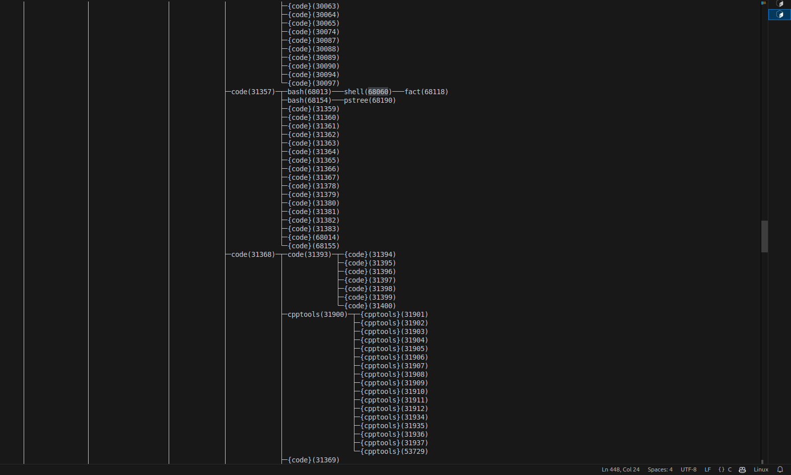

# Custom Command-Line Shell in C

## Overview

This project implements a custom command-line shell in C, offering an interactive user interface to execute various commands. It supports built-in commands, custom programs, I/O redirection, and efficient system resource usage while adhering to best coding practices.

---

## Features and Implementation Details

### **1. Command Execution**
#### **Accept User Input**
- The shell uses the `ncurses` library for an interactive terminal experience. User input is read using the `getch()` function and stored in a dynamically allocated string buffer.
- The current working directory is displayed in the prompt using `get_formatted_cwd()`.

#### **Parse the Input into Arguments**
- Input strings are tokenized using the `parse_command()` function, which splits the input based on delimiters (e.g., spaces, tabs).
- Arguments are stored in a dynamically allocated array, ensuring flexibility in handling varying command sizes.

#### **Execute Commands**
- External commands are executed using `fork()` and `execvp()`. The parent process waits for the child process to finish using `waitpid()`.
- The `process_command()` function differentiates between built-in commands (e.g., `cd`, `exit`, `help`) and external commands. 
- For built-in commands:
  - `cd`: Changes the current working directory using `chdir()`.
  - `exit`: Terminates the shell.
  - `help`: Displays usage instructions.
- Custom programs, like a factorial program, can be executed by specifying their paths (e.g., `./fact 10`).

#### **Error Handling**
- All system calls (e.g., `fork()`, `execvp()`, `chdir()`) are wrapped with error-checking mechanisms. Descriptive error messages are printed to the terminal in case of failures.

---

### **2. I/O Redirection**
#### **Input Redirection (`<`)**
- The `handle_io_redirection()` function identifies input redirection tokens in the command (e.g., `< input.txt`) and redirects standard input using `dup2()`.

#### **Output Redirection (`>`)**
- Similarly, the function processes output redirection tokens (e.g., `> output.txt`) and redirects standard output.

#### **Implementation Note**
- After handling redirection, the command is cleaned of redirection arguments using `remove_redirection_args()` to ensure proper execution.

---

### **3. Process Tree Visualization**
- The shell spawns child processes for command execution. By capturing the system's process hierarchy (e.g., using `ps` or `pstree`), users can visualize the parent-child relationship.
- A snapshot of the process tree, demonstrating this hierarchy, is included below:


---

### **4. Modular Code Structure**
#### **Functions**
- `parse_command()`: Tokenizes the user input.
- `execute_external_command()`: Handles external command execution.
- `process_command()`: Routes commands to either built-in handlers or external executors.
- `handle_io_redirection()`: Handles input/output redirection.
- `remove_redirection_args()`: Cleans commands of I/O redirection tokens.
- `get_formatted_cwd()`: Fetches and formats the current working directory.
- Utility functions (e.g., `string_init()`, `string_append()`) ensure efficient string handling.

#### **Header Guards and Macros**
- Code includes macros for safe memory allocation (`DA_APPEND`) and debugging (`ASSERT`).
- Header guards prevent redefinition and ensure modularity.

---

### **5. Error Checking and Reporting**
- All system calls are validated, and errors are reported with descriptive messages.
- Defensive programming practices, such as bounds checking and memory allocation checks, are implemented.

---

### **6. Efficiency and Resource Management**
- Dynamic memory allocation ensures efficient use of system resources.
- Child processes are cleaned up immediately after execution to prevent resource leaks.

---

## How to Compile and Run

1. **Compile** the code:
   ```bash
   gcc -o shell shell.c -lncurses
   ```

2. **Run** the shell:
   ```bash
   ./shell
   ```

---

## Usage

### Built-in Commands
1. `cd <directory>`: Changes the current directory.
2. `help`: Displays help information.
3. `exit`: Exits the shell.

### External Commands
- Run any executable program (e.g., `ls`, `grep`, `./my_program`).

### I/O Redirection
- Input: `< input.txt`
- Output: `> output.txt`

### Example
```bash
shell~$ ls > output.txt
shell~$ ./fact 10 < input.txt > output.txt
```

---

## Non-Functional Requirements

1. **Readability**: Functions and variables are descriptively named. The code is modular and well-documented.
2. **Error Handling**: Robust error-checking mechanisms ensure stability.
3. **Resource Efficiency**: Memory is dynamically allocated and freed as needed.

---

## Future Enhancements
1. Add support for piping (`|`) between commands.
2. Expand the set of built-in commands.
3. Improve the visual interface for process tree visualization.

---

## Process Tree Snapshot
Below is a visual representation of the process hierarchy during shell execution:


---
